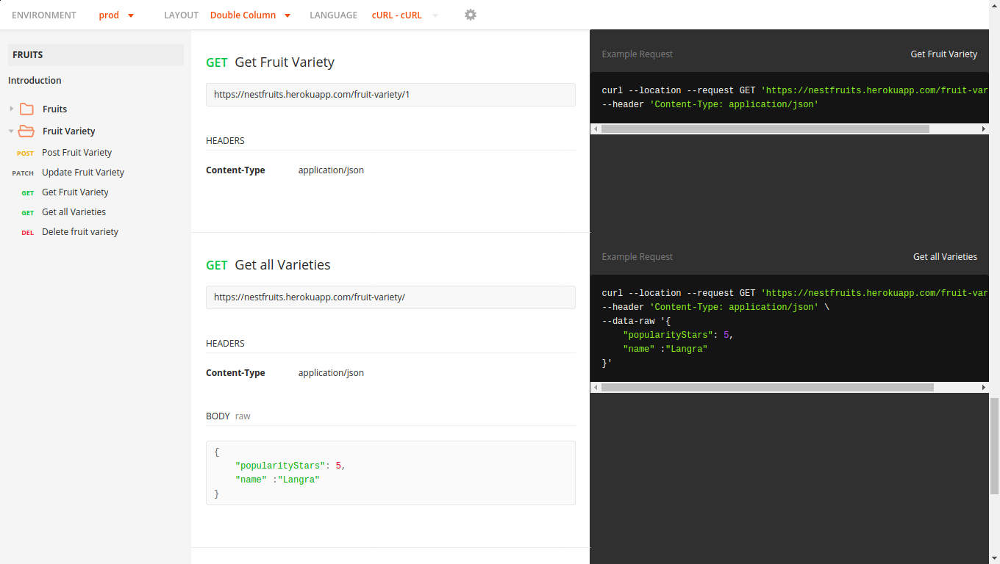
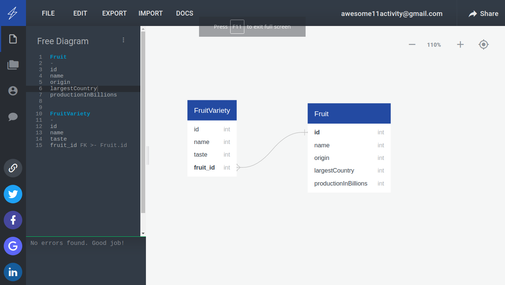

<p align="center">
  <a href="http://nestjs.com/" target="blank"></a>
</p>

# Hello Brother, Do not skip me you will learn from me.

[](https://travis-ci.org/joemccann/dillinger)
#### Interact application live at https://documenter.getpostman.com/view/11453962/T17J9SRn




#### This application as a guide to developers to help them understand   
  - Making Nestjs Application with Modular code
  - As a bonus to enhance your arrays knowledge by creating complete in memory crud operations
I attempted to make the app run straight out of the box so I implemented all the crud operations in memory.

# Helpful advice 

- The src/utils folder is packed up with number of utility files which helps in development.  
- Also use postman to make requests for application which has the ability to make professional and great docs.
- Postman has the ability to test the rest points which you could employ if using a microservice architecture.
- In case you have a unix based enviroment you could add this to your .bashrc (Google it if you seem unfamilar) file with that you only need to issue
```feature moduleName``` 
 and a complete module will be available to you. If you are on windows you could use
```snest g module moduleName && nest g service moduleName --no-spec  && nest g controller moduleName --no-spec```
```sh
    feature() {

        if [ "$1" = "cl" ]; then
            nest g cl "$2" --no-spec
        else
            nest g module "$1" --no-spec 
            nest g service "$1" --no-spec
            nest g controller "$1" --no-spec
        fi
    }
```

####  Although the app is simple enough feautering 1-n reationship between fruit and fruitvarieties but I will guide you through the process to be used when building serious backends
  - Use an ER tool https://www.quickdatabasediagrams.com/ it is going to help you visulize your database  

- After that you may use our old friend pen and paper jot down the modules and controllers which would be needed and their interactions.       
- Follow bootom to top approch go with controllers and map down the request mappings when developing the crud Section you could use the RestInterface available at src/nest-utils/rest.service.ts


#### Install the dependencies and devDependencies and start the server.

```sh
$ npm install 
$ npm run start:dev
```
